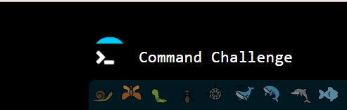
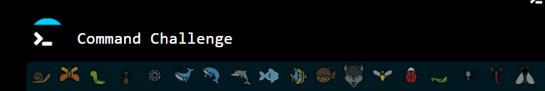
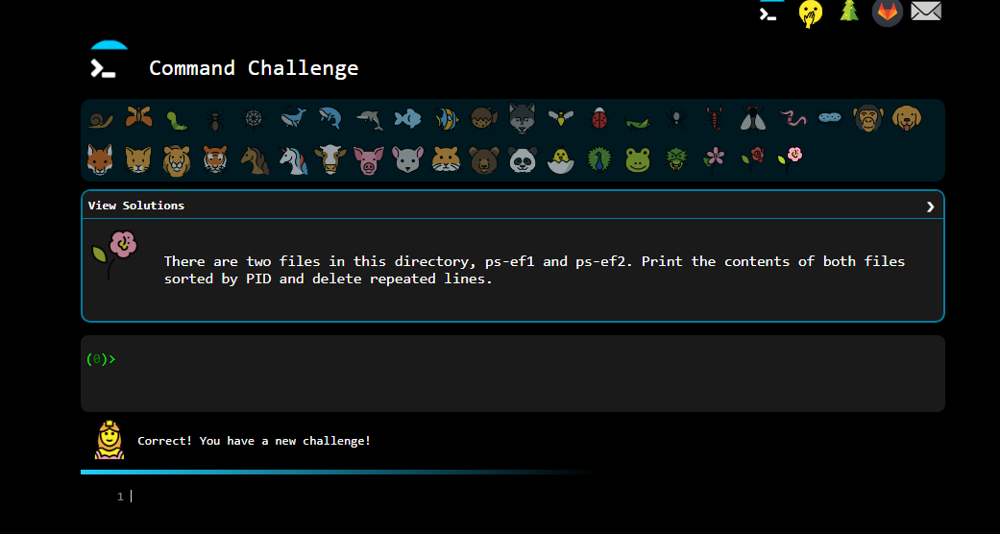

Command line for the win
<hr>

** In this project I learned more about bash script 
[CMD CHALLENGE](https://alx-intranet.hbtn.io/rltoken/a83_NOBEtXgFr1Yqej0HYA) is a pretty cool game challenging you on Bash skills. Everything is done via the command line and the questions are becoming increasingly complicated. It’s a good training to improve your command line skills!

``Tasks``
-----------------

**0. First 九 tasks**
#advanced
``Complete the first 9 tasks.``


**1. Reach חי completed tasks**
#advanced
```Complete the 9 next tasks, getting to 18 total.```


**2. Reach the perfect cube, 27**
#advanced
```Complete the 9 next tasks, getting to 27 total.```
